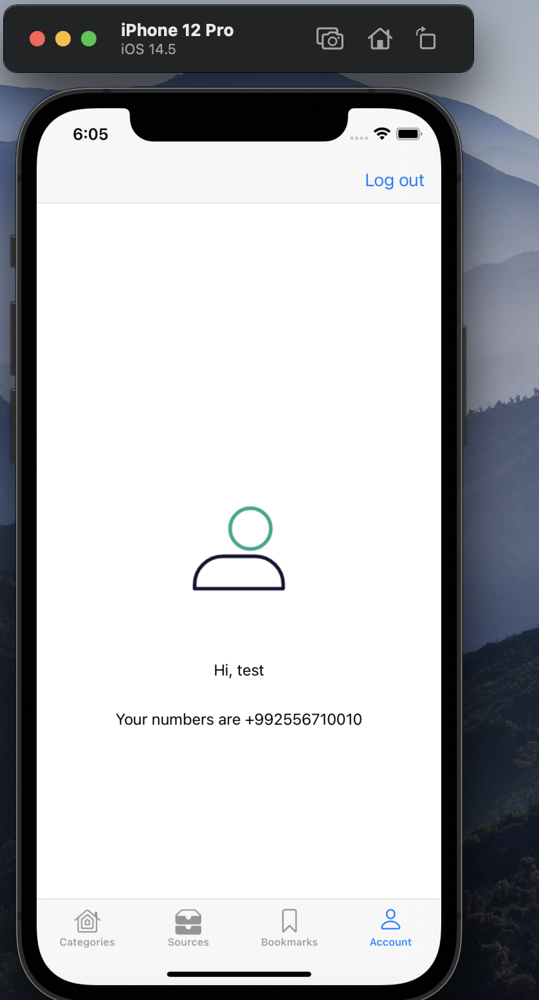
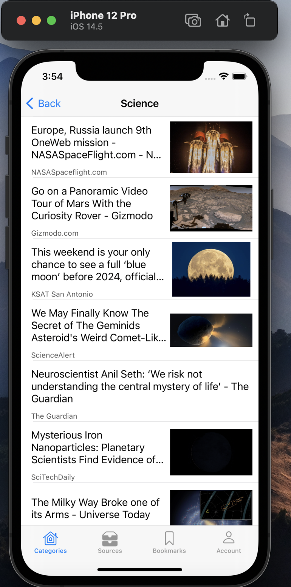
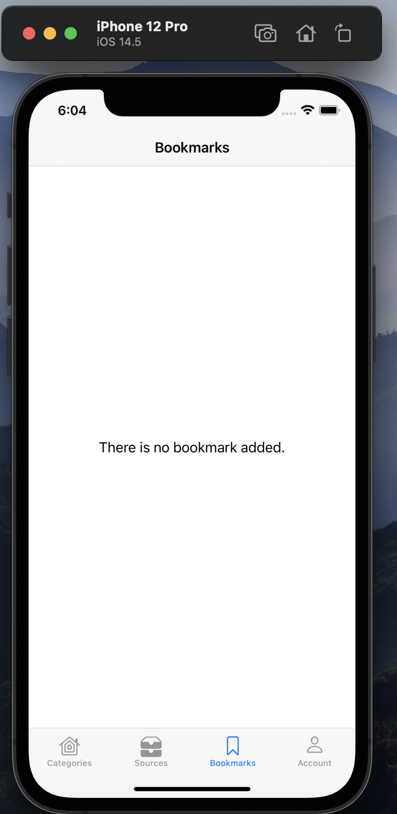
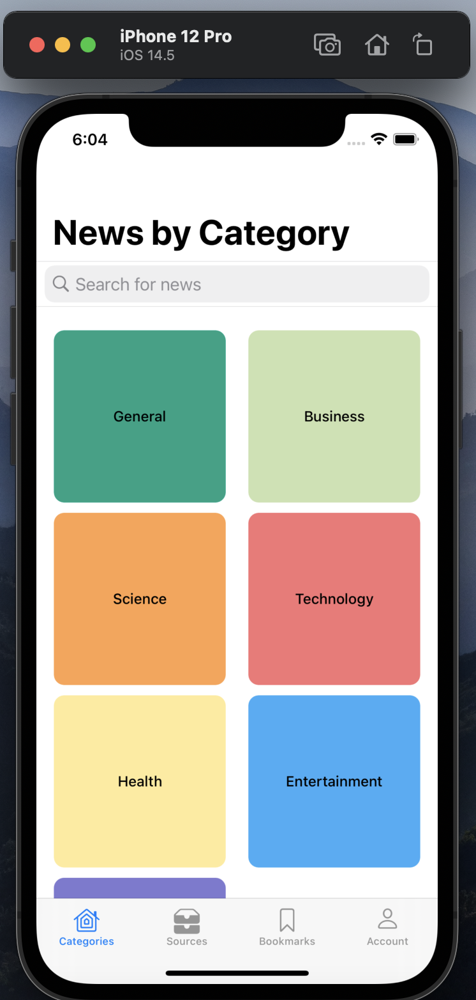
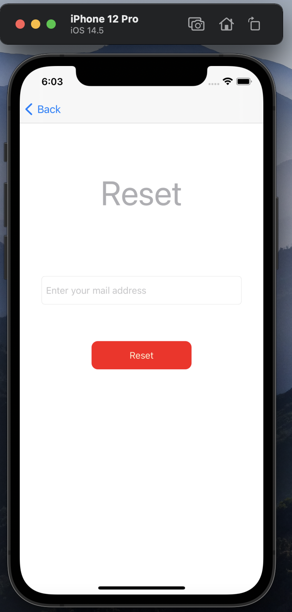
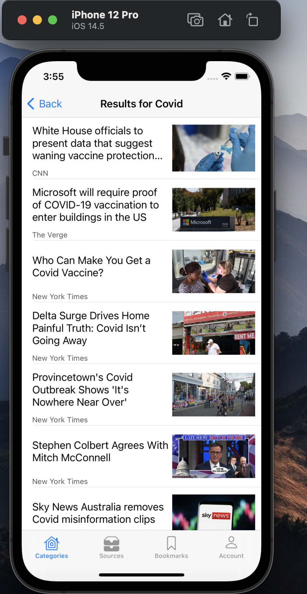
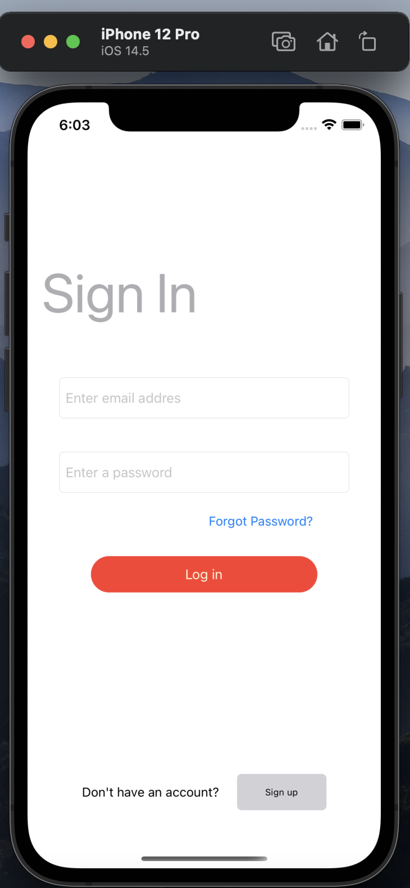
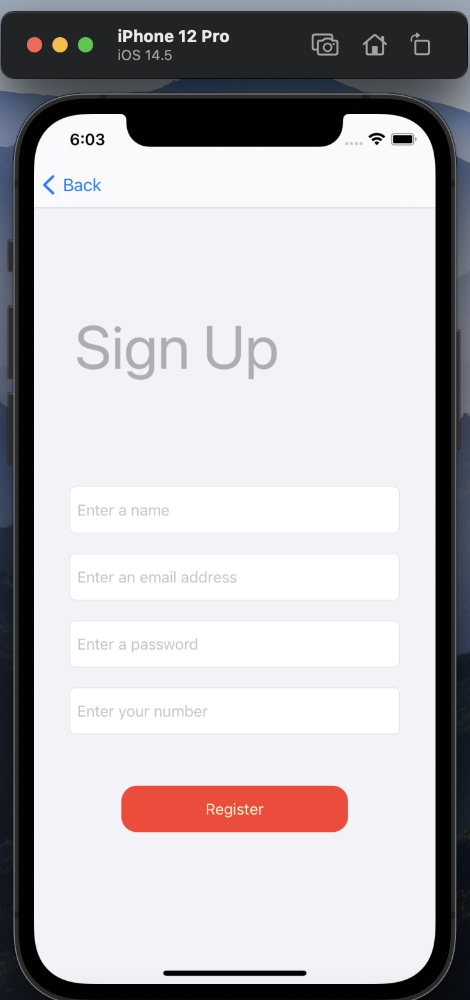
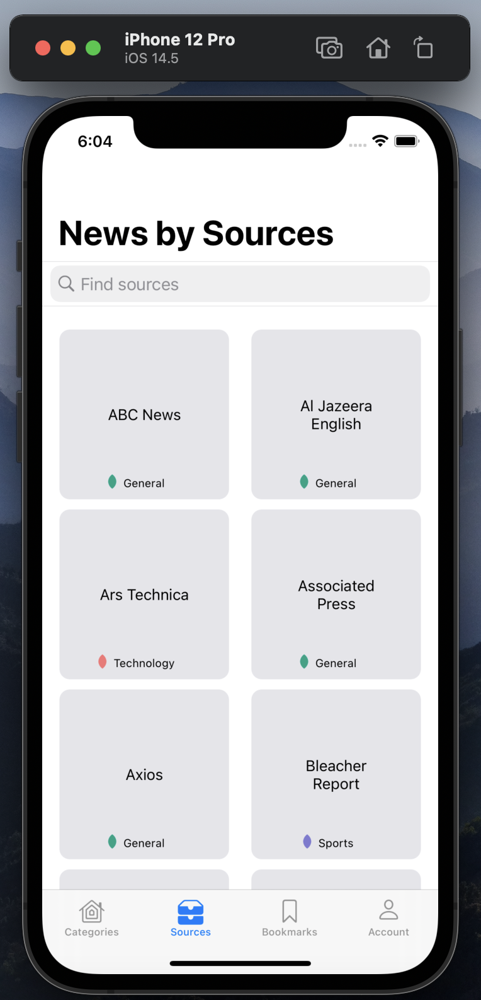
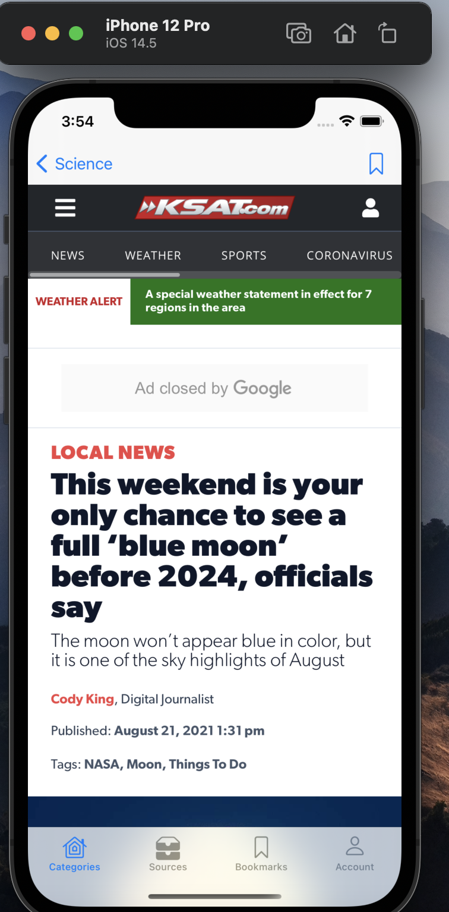

# News-App
An iOS application retrieves and displays headlines from [NewsAPI](https://www.google.com).

## Description

This application allows to users authorize with the email and password.
News-App collects all the haedlines from the several categories and displays them in CollectionView. 
The users also could search for desired topics or article source. In the sources, the app shows the top headlines from particular sources. Moreover, it has bookmark where the user can store desired article.
 
## Screenshots
   

 


 


## Built by
* [Swift](https://developer.apple.com/swift/) language.
* [Kingfisher](https://github.com/onevcat/Kingfisher) library.
* [SkeletonView](https://github.com/Juanpe/SkeletonView) library.
* [CoreData](https://developer.apple.com/documentation/coredata) library.
* [Firebase](https://firebase.google.com/docs/ios/setup) library.
* [IQKeyboardManagerSwift](https://github.com/hackiftekhar/IQKeyboardManager) library

## Author
Bakhtovar Umarov - [LinkedIn](https://www.linkedin.com/in/bakhtovar/)

## How to use

Install pods:
1. Open terminal and write cd PROJECT_PATH
2. pod init 
3. pod install

For more open this [link](https://stackoverflow.com/questions/20755044/how-to-install-cocoapods) 

## License

This project is licensed under the MIT License, see more [license](https://github.com/bakhtovar/News-App/blob/news/LICENSE.md).

## Important 

In Constans.swift

```
struct K {
    static let APIKey = "ENTER_YOUR_KEY" // MARK: - ENTER HERE YOUR NEWS API KEY
    }
```

Enter your News API key inside the quotes marks! Without it the application will not work.
